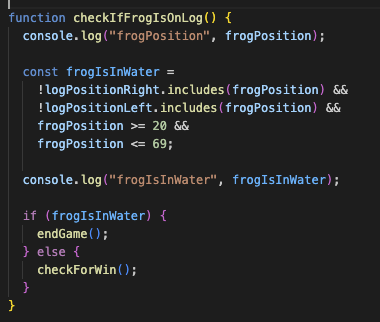

# Olaf's Summer Quest

Inspired by classic "Frogger" mechanics, but with a wintery twist featuring Olaf from Disney's Frozen.

## GamePlay
Use the arrow keys to move Olaf (frog) around the grid.
Navigate Olaf to the dandelion field at the top of the grid.
Avoid the icicles (.car) and stay on the floating logs without getting into the water to get Olaf across safely.
Reach the top safely to win.

 ## Run the code
Tech- JavaScript, CSS and HTML file.
To run this, make sure you have node installed.
Navigate to project directory: cd olaf-summer-quest.
Open the project in VS Code
Open index.html in a web browser to start playing.

## Code

The game is a "Frogger"-style concept, with a frog jumping across logs and dodging cars.  This was then personalsied to make the game more fun. The names remain the same in the code however visually have changed.

- .frog -> Olaf
- .car -> Icicles
- .log -> Floating ice
- frogonlog-> Olaf on Ice

## Game Features
 - 10x10 grid layout
 - Moving cars/logs that act as obstacles for olaf to avoid.
 - Win/Lose dialogs that appear when losing or winning and giving the option to play again which resets the game
 - Soundtrack playing when game is being played
 - Soundtrack paused when losing and another audio played for losing.

## Challenges faced 

### Grid Layout and Scaling

An array with 100 elements is generated to represent the grid cells. A 'forEach' loops iterates over this array,creates 
 elements with the class 'cell' to the grid container to  provide the visual layout of the game. 

### Synchronising Log and Car Movements

SetInterval for movement to control the timing of the movement animations for logs and cars. This function repeatedly executes a specified function at set intervals, allowing for continuous and smooth motion.

*// logInterval = setInterval(moveLog, 1500);    
carInterval = setInterval(moveCars, 1000); //*

#### Log Movement - 
In moveLog(), logs are moved across the grid by updating their positions. Logs on the right are moved to the right, and logs on the left are moved to the left. When logs move off the grid they are repositioned to the opposite edge to maintain continuous movement and updates every 1.5secs.

screenshot.png)

- if log reaches the  right edge ( position %10 === 9) it wwraps around to the left. 
- if log reached the left edge ( position %10 === 0) wraps to the right.
- logs are removed from old position and added to the next
- if frog is on the log, it moves with the log. 
- if the frog on the log moves to the edge, checkifFrogisOnEdge is triggered to determine whether to end the game.

#### Car Movement- 
In moveCars() cars are  moved across the grid. Cars moving to the right are adjusted to wrap around when they reach the right edge, and cars moving to the left wrap around when they reach the left edge every 1 second using setInterval. Collision checks with the frog are performed during this movement.

screenshot.png)

- similar concept to the logs. if car reaches the edge of grid it will wrap and restart on the same row.
- if a car moves to the positio of the frog ( position === frogPosition) then game will end.

### Collision Detection

Accurately detecting collisions when frog was hit by a car or fell into the water, triggering the appropriate end-game conditions.

Frog will die and endgame if : 
- frog is hit by car :
The game detects when the frog overlaps with a car's position, triggering endgame.

- frog jumps onto car : If the frog lands on a car, it is considered a collision, and the game ends.

- if frog jumps into the water: When the frog jumps into a water cell without being on a log, it triggers the end-game condition.

- if frog stays on log and hits edge of the grid: If the frog remains on a log and moves to the edge of the grid, it results in a game-over.

### Custom Dialogs for Game Endings

Created Dialog Elements in HTML:
 I used the same winGif id and only changed the img src for the loseDialog.

Displayed the Dialogs with Javascript: 

addWinDialog(): This function displays the win dialog when the player wins the game. It also removes the keydown event listener to stop the frog from moving. It restarts the game when clicking the button by refreshing the page.

addLoseDialog(): This function displays the lose dialog when the player loses. Similar to the win dialog, it removes the keydown event listener which stops the frog from moving and provides a button to restart the game which is done through refreshing it.

In both Dialogs, the dialog.showModal() is used to present game-ending messages amd gifs in a way that stops any game interactions without the player clicking to restart the game.

### Managing Multiple Event Listeners

## Future Enhacements
- Level Complexity- faster cars, more logs

- Adding lives and the ability to restart from point of collision. 

- Adding a set time limit for how long user has to cross before game ending.

- Colecting carrots along the way and keeping score

- Power ups to grant temporary time limited invincibilty. 

